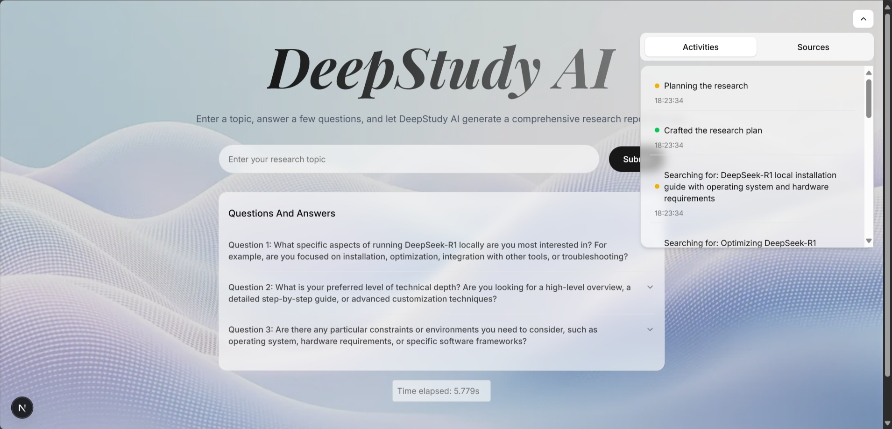
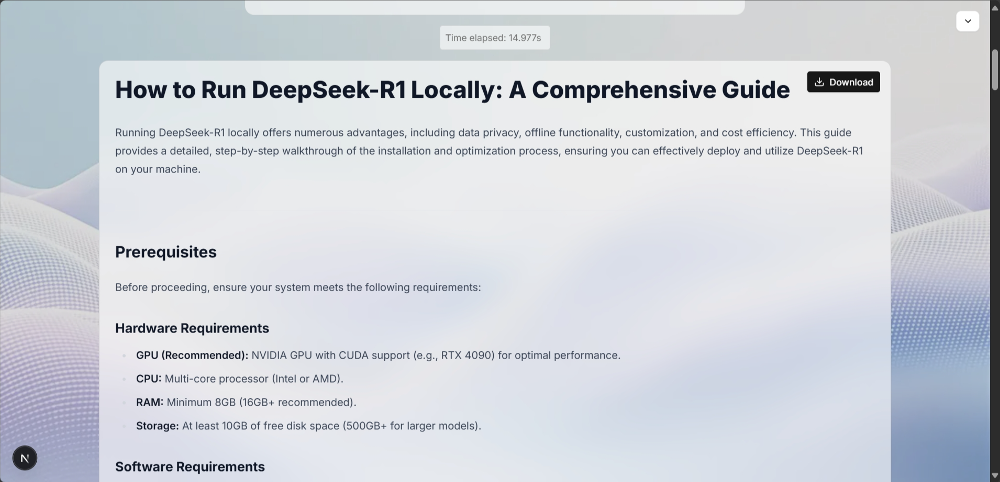

# 🔍 DeepStudy AI

DeepStudy AI is an advanced research assistant that helps generate comprehensive reports based on a given topic. By leveraging AI models like DeepSeek, Llama3, Gemma2, and Gemini (via OpenRouter and Groq), this system refines research queries, performs web searches, and compiles structured reports with relevant insights.

## 📸 Preview

<p>
  </img>
  </img>
</p>

## 🧠 AI-Driven Research Workflow

<p>
  </img>
</p>

DeepStudy AI follows an iterative research process:

1. **Topic Input & Clarification** – Users enter a topic, and the system generates follow-up questions to improve research quality.
2. **Research Plan Generation** – Based on user input, it formulates a research strategy.
3. **Web Search (Exa AI API)** – Queries are optimized and executed to fetch relevant content.
4. **Content Extraction & Filtering** – Retrieved data is analyzed for relevance.
5. **Iterative Research Loop** – If necessary, the system refines queries and repeats searches to enhance report quality.
6. **Report Generation** – A structured and well-researched report is compiled.

## 🚀 Key Features

- 🔧 **Fully Customizable Research Flow**
- 🔍 **Adaptive Search Queries** for better results
- ⚙️ **Seamless AI Model Integration** (DeepSeek, Llama3, Gemma2, Gemini)
- 💼 **Modular & Scalable Architecture**
- 🌐 **Built with Next.js & Vercel AI SDK**
- ♻️ **Iterative Research Process** for accuracy

## 🛠️ Tech Stack

- **Framework**: Next.js
- **Styling**: Tailwind CSS, Shadcn UI
- **AI Integration**: Vercel AI SDK
- **LLMs**: Gemini, DeepSeek, Llama3, Gemma2 (via OpenRouter & Groq)
- **Web Search**: Exa Search API
- **Language**: TypeScript

## 📌 Prerequisites

Before getting started, ensure you have:

- An **OpenRouter API Key** (or alternative LLM providers like Groq)
- An **Exa Search API Key**

## 🔧 Setup Instructions

1. **Clone the Repository**

   ```bash
   git clone https://github.com/its-kumar-yash/deep-study-ai-agent
   cd Deep-Research-AI-Agent
   ```

2. **Install Dependencies**

   ```bash
   npm install
   ```

3. **Configure Environment Variables**

   - Create a `.env` file in the root directory.

4. **Run the Development Server**

   ```bash
   npm run dev
   ```

   - Open [http://localhost:3000](http://localhost:3000) in your browser.

## 🤝 Contributing

We welcome contributions! Whether it's a bug fix, feature suggestion, or improvement, feel free to submit a pull request.

## 📜 License

Distributed under the MIT License. See `LICENSE` for more details.


